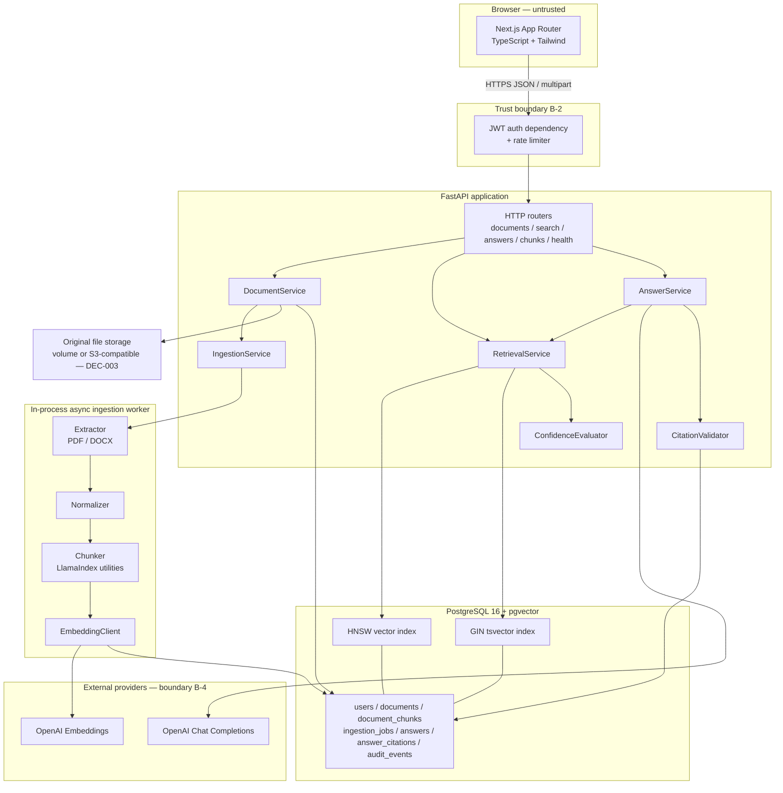
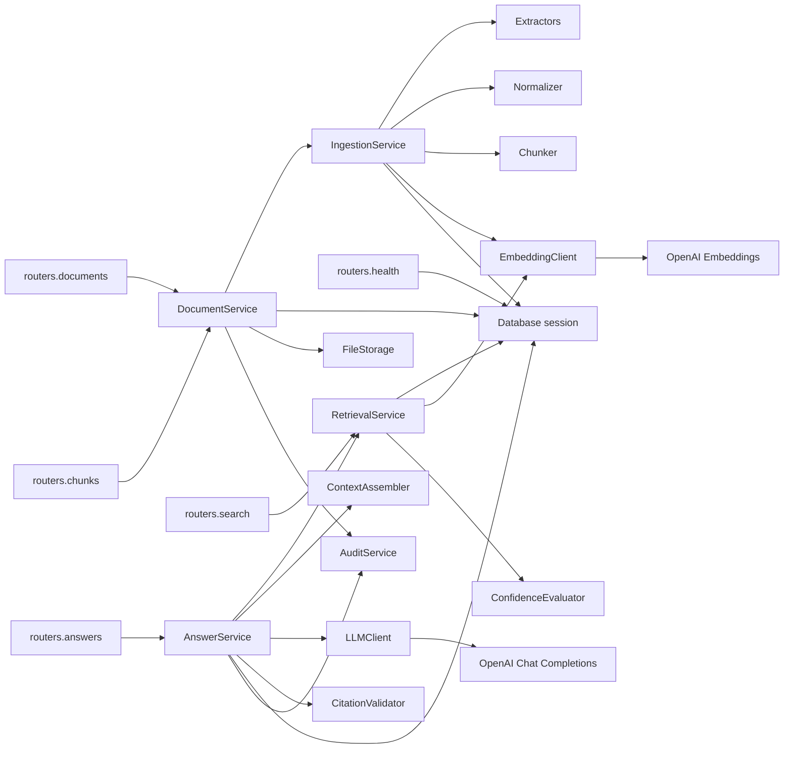
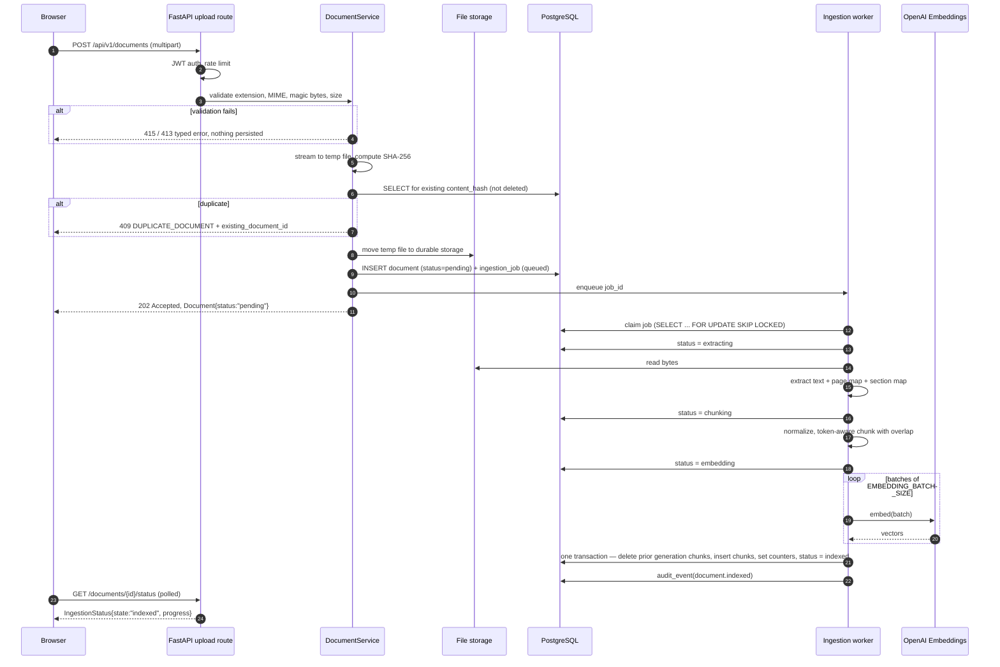
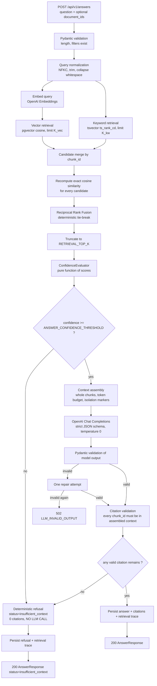
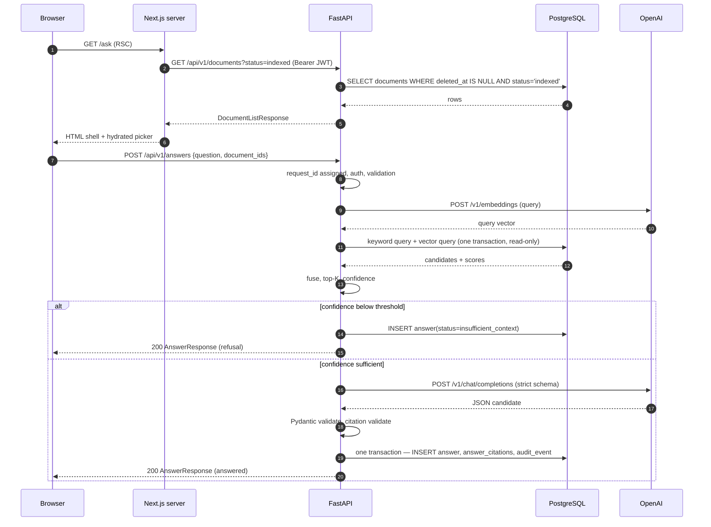
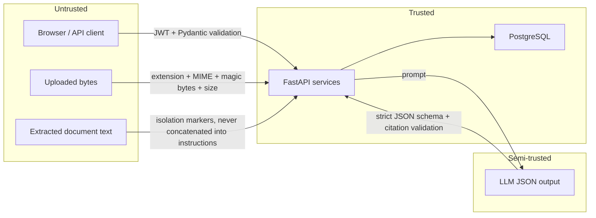

# ARCHITECTURE.md — System Architecture

**Authority:** Authoritative for *system decomposition, boundaries, control flow, trust boundaries, and synchronous/asynchronous behaviour*. Requirements come from [PRD.md](PRD.md); contracts come from [API_SPEC.md](API_SPEC.md), [SCHEMA_CONTRACT.md](SCHEMA_CONTRACT.md), [DATABASE.md](DATABASE.md). Where this document and a contract document disagree on a field name or shape, the contract document wins.

---

## 1. Architectural Principles

| ID | Principle | Consequence |
|----|-----------|-------------|
| **AP-1** | **Deterministic core, probabilistic edge.** All state transitions, authorization, validation, scoring, and the answer/refuse decision are deterministic Python + SQL. The LLM occupies exactly one position in the system: turning already-selected passages into prose. | The refusal gate (`FR-023`) executes *before* the LLM call and cannot be influenced by it. |
| **AP-2** | **Evidence is authoritative; the model is not.** Retrieved chunks are the system of record for factual content. | `INV-001`, `INV-002`, `BR-008`. |
| **AP-3** | **Contracts before code.** Pydantic v2 models are the single schema authority; OpenAPI is generated from them; TypeScript is generated from OpenAPI. | `NFR-009`; drift fails CI. |
| **AP-4** | **The database enforces what the database can enforce.** Foreign keys, unique constraints, check constraints, and generated columns are used in preference to application-level checks. | `INV-005`, `INV-007`, `INV-011`. |
| **AP-5** | **Untrusted input stops at a boundary.** Uploaded bytes and extracted text are untrusted, all the way into the prompt. | `SEC-006`, `SEC-008a`–`SEC-008g`, `FR-038`. |
| **AP-6** | **Ingestion is asynchronous; querying is synchronous.** Upload returns immediately with a tracked job; questions are answered in-request. | `ADR-010`. |
| **AP-7** | **Everything auditable.** An answer persists its full retrieval trace, so any answer can be re-explained without re-running the pipeline. | `FR-025`, [OBSERVABILITY.md](OBSERVABILITY.md). |
| **AP-8** | **No hidden knowledge in the model.** The prompt contains only the assembled chunks plus the question. No corpus summaries, no fine-tuning, no memory. | `NG-9`, `FR-020`. |

---

## 2. System Boundaries

| Boundary | Inside | Outside | Crossing mechanism |
|----------|--------|---------|--------------------|
| **B-1 Product boundary** | Next.js app, FastAPI app, PostgreSQL+Pgvector, ingestion worker | User's browser, OpenAI APIs, operator's shell | HTTPS, HTTPS, container exec |
| **B-2 Trust boundary (client)** | FastAPI | Browser, any HTTP client | JWT bearer validation on every `/api/v1/*` request except token issuance |
| **B-3 Trust boundary (content)** | Deterministic services | Uploaded document bytes and all text derived from them | Validation → extraction sandboxing → structural isolation in prompts |
| **B-4 Trust boundary (model)** | Backend | OpenAI Embeddings, OpenAI Chat Completions | Egress-only HTTPS; model output is validated against a Pydantic schema before it can influence anything |
| **B-5 Data boundary** | PostgreSQL | Object/file storage for original uploads | SQLAlchemy sessions; storage adapter (`DEC-003`) |

**The LLM has no inbound path into the system.** It cannot call tools, cannot reach the database, and cannot emit anything except a JSON object matching `GroundedAnswerModel` ([LLM_SPEC.md](LLM_SPEC.md#7-structured-output-contract)).

---

## 3. High-Level Architecture

---

## 4. Component Architecture

| Component | Responsibility | MUST NOT |
|-----------|----------------|----------|
| `api/routers/*` | HTTP shape only: parse, validate, delegate, serialise, map exceptions to responses | Contain business rules or SQL |
| `services/document_service.py` | Upload validation orchestration, duplicate detection, document CRUD, soft delete | Call the LLM |
| `services/ingestion_service.py` | Owns the ingestion state machine, job claiming, retries, generation swap | Emit HTTP responses |
| `ingestion/extractors/{pdf,docx}.py` | Bytes → `ExtractedDocument` (text + page map + section map) | Persist anything |
| `ingestion/normalizer.py` | Deterministic text normalisation | Drop content silently |
| `ingestion/chunker.py` | `ExtractedDocument` → ordered `ChunkDraft[]` with offsets and metadata | Call providers |
| `providers/embedding_client.py` | Batched embedding calls, retry, dimension assertion | Know about documents |
| `services/retrieval_service.py` | Keyword + vector queries, RRF fusion, filtering, top-K, cosine recomputation | Call the LLM |
| `services/confidence_evaluator.py` | Pure function: scores → `ConfidenceReport` | Do I/O |
| `services/context_assembler.py` | Chunks → token-budgeted, labelled, isolated context block | Reorder for relevance (ordering is retrieval's job) |
| `providers/llm_client.py` | Structured-output call, timeout, one repair retry | Retry indefinitely or degrade to free text |
| `services/citation_validator.py` | Verify every returned `chunk_id` against assembled context; drop unknown; enforce `BR-006` | Ask the model to fix itself |
| `services/answer_service.py` | Orchestrates retrieval → gate → assemble → generate → validate → persist | Contain retrieval or scoring maths |
| `services/audit_service.py` | Append-only audit events | Update or delete events |
| `db/models/*` | SQLAlchemy 2.0 declarative models | Contain business logic |
| `schemas/*` | Pydantic v2 request/response models | Touch the database |

### 4.1 Component dependency graph

**Dependency rules (enforced by an import-linter contract, `TEST-502`):**

- `routers` → `services` → (`db`, `providers`, `ingestion`) → `schemas`. No upward imports.
- `schemas` imports nothing from `db`, `services`, or `providers`.
- `ConfidenceEvaluator`, `CitationValidator`, `Normalizer`, and `Chunker` are pure: no I/O, no clock, no randomness. This is what makes `NFR-004` testable.
- Only `providers/*` may import the OpenAI SDK.

---

## 5. Logical Architecture (layers)

| Layer | Contents | Authority document |
|-------|----------|--------------------|
| L1 Presentation | Next.js routes, server components, client components, Tailwind | [FRONTEND_SPEC.md](FRONTEND_SPEC.md) |
| L2 Contract | Pydantic v2 schemas → OpenAPI → generated TypeScript | [SCHEMA_CONTRACT.md](SCHEMA_CONTRACT.md), [TYPESCRIPT_CONTRACT.md](TYPESCRIPT_CONTRACT.md) |
| L3 Application | FastAPI routers, dependencies, exception handlers | [API_SPEC.md](API_SPEC.md), [ERROR_HANDLING.md](ERROR_HANDLING.md) |
| L4 Domain services | Document, Ingestion, Retrieval, Answer, Citation, Confidence | this document, [RAG_SPEC.md](RAG_SPEC.md) |
| L5 Knowledge | Extraction, chunking, embedding, hybrid retrieval | [INGESTION_SPEC.md](INGESTION_SPEC.md), [SEARCH_SPEC.md](SEARCH_SPEC.md) |
| L6 Persistence | SQLAlchemy models, Alembic migrations, pgvector | [DATABASE.md](DATABASE.md), [MIGRATION_PLAN.md](MIGRATION_PLAN.md) |
| L7 Platform | Docker, Compose, config, health checks | [DOCKER_AND_DEVOPS.md](DOCKER_AND_DEVOPS.md), [ENVIRONMENT.md](ENVIRONMENT.md) |

---

## 6. Frontend ↔ Backend Interaction

- The browser talks **only** to FastAPI. The Next.js server never proxies OpenAI and never holds provider keys.
- Server Components fetch list/detail data with the caller's JWT forwarded from an httpOnly cookie; Client Components perform mutations and polling.
- The frontend holds **no** business rules. It never decides whether an answer is grounded, never computes confidence, and never re-ranks results — it renders what the backend decided.
- All types on the client are generated from the backend OpenAPI document; hand-written duplicates are prohibited (`NFR-009`).

Full route/component contract: [FRONTEND_SPEC.md](FRONTEND_SPEC.md).

---

## 7. Document Ingestion Flow

Ingestion is **asynchronous** (`ADR-010`). The HTTP request performs only cheap, safe work; everything expensive happens in an in-process asyncio worker driven by a database-backed job row.

Failure at any stage writes `failure_code` + `failure_message`, increments `attempt_count`, and either reschedules with backoff (retryable) or moves to `failed` (terminal). See [INGESTION_SPEC.md](INGESTION_SPEC.md#8-state-machine).

---

## 8. RAG Query Pipeline

The two properties that make this Tier 3 rather than "an LLM with search":

1. **The gate at `G` is arithmetic, not linguistic.** A refusal is produced without the model ever seeing the question.
2. **The validator at `CV` can only remove citations, never add them.** The model cannot mint a citation that retrieval did not supply.

---

## 9. Request / Data Flow (representative read)

---

## 10. Synchronous vs Asynchronous Operations

| Operation | Mode | Rationale | Bound |
|-----------|------|-----------|-------|
| Upload accept | Sync | Only validation + hash + insert | `UPLOAD_TIMEOUT_SECONDS` = 60 |
| Extraction / chunking / embedding | **Async** worker | Unbounded and provider-dependent | Per-stage timeouts, `INGESTION_MAX_ATTEMPTS` = 3 |
| Status polling | Sync read | Cheap indexed read | — |
| Search | Sync | Two indexed queries + one embedding call | `NFR-002` ≤ 800 ms p95 |
| Answer | Sync | Users need the validated result atomically; streaming would display unvalidated citations (`NG-8`) | `LLM_TIMEOUT_SECONDS` = 45; total `ANSWER_TIMEOUT_SECONDS` = 60 |
| Delete | Sync | Single UPDATE | — |
| Reprocess | Sync accept + async execute | Same as upload | — |
| Audit write | Sync, in the same transaction as the audited change | An audit event that can be lost is not an audit event | — |

Concurrency model: FastAPI async endpoints; blocking CPU work (PDF parsing, tokenisation) runs in a bounded thread pool (`INGESTION_WORKER_CONCURRENCY`, default 2) so the event loop is never starved.

---

## 11. Failure Paths

| Failure | Detection | System behaviour | Never |
|---------|-----------|------------------|-------|
| Unsupported/forged file type | Magic-byte check | `415`, security audit event | Parse it anyway |
| Oversized upload | Streaming byte counter | `413`, stream aborted | Buffer the whole file first |
| Corrupt/encrypted PDF | Extractor exception | `failed` + specific code, retry not attempted | Retry a deterministic parse failure |
| Empty text layer | Char-count threshold | `failed` / `EXTRACTION_NO_TEXT_LAYER` | Index zero chunks |
| Embedding provider 429/5xx | HTTP status | Exponential backoff, up to `INGESTION_MAX_ATTEMPTS`, then `failed` | Commit a partial chunk set |
| Embedding dimension mismatch | Assertion on vector length | Job fails, startup readiness fails | Truncate or pad a vector |
| DB unavailable | Connection error | `503` `DATABASE_UNAVAILABLE`; readiness red | Serve stale answers |
| Vector index missing | Readiness probe | `503` with `vector_index: false` | Silently fall back to a sequential scan in production |
| Low retrieval confidence | Confidence gate | `insufficient_context`, no LLM call | Ask the LLM to "try anyway" |
| LLM timeout | Client timeout | `504` `LLM_TIMEOUT` | Return a partial answer |
| LLM malformed output | Pydantic validation | One repair attempt → `502` `LLM_INVALID_OUTPUT` | Regex-scrape the text |
| LLM fabricated citation | Citation validator | Citation dropped; if none remain → `insufficient_context` | Present it to the user |
| Prompt injection in a document | Structural isolation + instruction hierarchy | Treated as data | Follow it |

Canonical error bodies: [ERROR_HANDLING.md](ERROR_HANDLING.md).

---

## 12. Trust Boundaries

Rules:

- **TB-1** Nothing crosses into *Trusted* without a schema check.
- **TB-2** Extracted text is never interpolated into a system prompt; it appears only inside delimited, numbered `<chunk>` blocks in a user-role message ([LLM_SPEC.md](LLM_SPEC.md#6-context-formatting)).
- **TB-3** LLM output is *semi-trusted*: syntactically constrained, semantically verified against the assembled context, and never used to select or authorise anything.
- **TB-4** Provider API keys exist only in the backend process environment; they are never sent to the browser and never logged.

---

## 13. Scalability Considerations

| Dimension | v1 design | Growth path |
|-----------|-----------|-------------|
| Corpus size | HNSW index on `document_chunks.embedding`, `m=16`, `ef_construction=64`; `ef_search` tuned per query load | Partition `document_chunks` by `document_id` hash; move to a dedicated vector service beyond ~10M chunks |
| Ingestion throughput | In-process worker, `SKIP LOCKED` job claiming — already multi-process safe | Run the worker as a separate container replica set; no code change (`ADR-010`) |
| Read scaling | Stateless FastAPI; scale horizontally behind a load balancer | Add a Postgres read replica for search |
| Embedding cost | Batched calls; content-hash dedupe prevents re-embedding identical documents | Cache embeddings by chunk `content_hash` across documents |
| LLM cost | Hard `LLM_MAX_CONTEXT_TOKENS` cap; refusal path skips the LLM entirely | Smaller model for routing; larger only for long-context questions |
| Hot path latency | Two indexed queries + 1 embedding call before any LLM work | Cache query embeddings for repeated questions keyed by normalised query hash |

Deliberate non-scaling choices: no message broker, no separate vector database, no cache tier in v1. Each is unnecessary at the stated scale (`A-3`) and each would add an unsynchronised source of truth, violating `AP-4`.

---

## 14. Security Boundaries (summary)

Full detail in [SECURITY_SPEC.md](SECURITY_SPEC.md); this section only names the boundaries.

| ID | Boundary | Control |
|----|----------|---------|
| SB-1 | Anonymous → authenticated | JWT bearer, HS256, short-lived access token |
| SB-2 | Authenticated → authorized action | Route dependencies implementing `BR-011`–`BR-013` |
| SB-3 | Network → filesystem | Uploads written only to a dedicated storage root with generated names; original filename is metadata only |
| SB-4 | Document content → LLM instruction space | Structural isolation, instruction hierarchy, injection test suite |
| SB-5 | Application → provider | Egress allowlist; keys from environment; no key material in logs, errors, or responses |
| SB-6 | Logs → sensitive data | Document text and question text are excluded from structured logs (`NFR-012`) |

---

## 15. Cross-References

| Concern | Authoritative document |
|---------|------------------------|
| Entities and lifecycles | [DOMAIN_MODEL.md](DOMAIN_MODEL.md) |
| Tables, indexes, pgvector settings | [DATABASE.md](DATABASE.md) |
| Endpoints and status codes | [API_SPEC.md](API_SPEC.md) |
| Pydantic models | [SCHEMA_CONTRACT.md](SCHEMA_CONTRACT.md) |
| Retrieval algorithm and constants | [SEARCH_SPEC.md](SEARCH_SPEC.md) |
| End-to-end RAG pipeline | [RAG_SPEC.md](RAG_SPEC.md) |
| Prompting and model contract | [LLM_SPEC.md](LLM_SPEC.md) |
| Ingestion state machine | [INGESTION_SPEC.md](INGESTION_SPEC.md) |
| Citation format and validation | [CITATION_SPEC.md](CITATION_SPEC.md) |
| Decision rationale | [ADR.md](ADR.md) |
