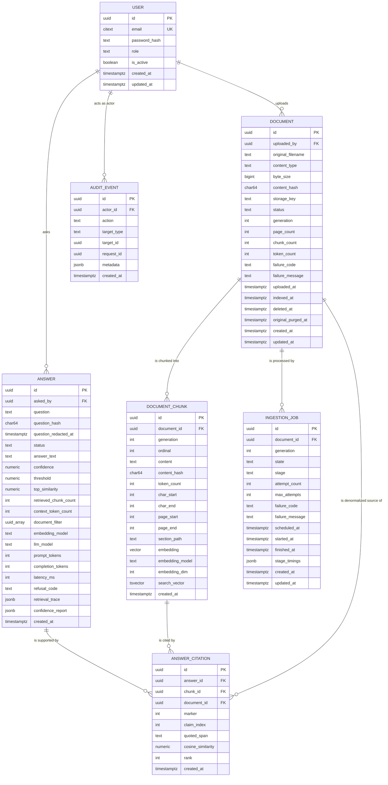
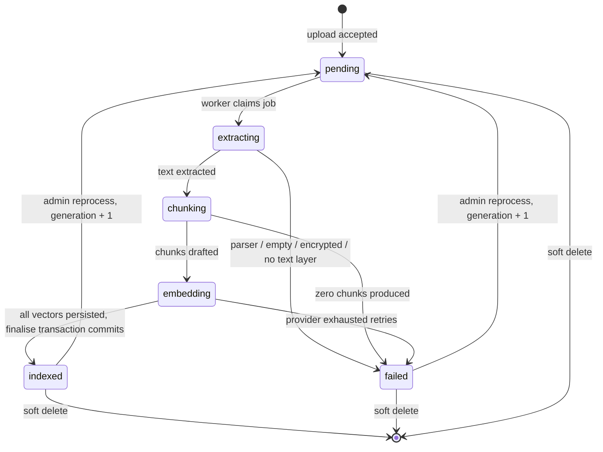
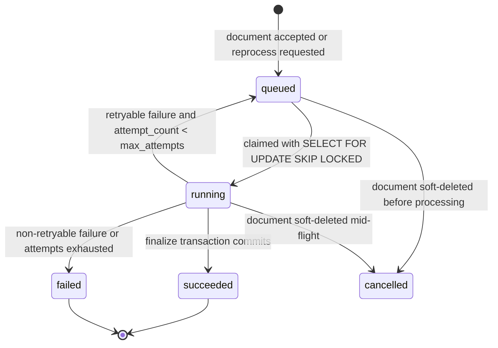

# DOMAIN_MODEL.md — Domain Model

**Authority:** Authoritative for *entity identity, relationships, lifecycles, invariants, and which data is mutable*. Physical column types, indexes and constraints are in [DATABASE.md](DATABASE.md); wire shapes are in [SCHEMA_CONTRACT.md](SCHEMA_CONTRACT.md). Where naming differs, this document defines the canonical domain name and [DATABASE.md](DATABASE.md) defines the physical name.

---

## 1. Entity Evaluation

Candidate entities were evaluated rather than assumed. Recorded here so later contributors do not re-litigate them.

| Candidate | Verdict | Reasoning |
|-----------|---------|-----------|
| `User` | **Entity** | Needed for ownership (`BR-012`), audit actor identity, and JWT subject. Minimal: no profile, no teams (`NG-1`). |
| `Document` | **Entity** | The aggregate root of ingestion. Independent identity and lifecycle. |
| `DocumentChunk` | **Entity** (child of `Document`) | Has independent identity because citations reference it by ID and it outlives an answer request. Not a value object: identity matters. |
| `IngestionJob` | **Entity** | Rejected the alternative of storing only `Document.status`: retries, attempt counts, per-stage timings and failure history need their own row to remain auditable across attempts. |
| `Answer` | **Entity** | Immutable record of a question, its decision, and its trace. Needed for `FR-025`, `AP-7`. |
| `AnswerCitation` | **Entity** (child of `Answer`) | Modelled as a first-class row rather than JSON so that `INV-001` is a foreign key, not a hope. |
| `RetrievalTraceItem` | **Value object**, stored as JSONB on `Answer` | Never referenced by ID from elsewhere; only ever read as a whole with its answer. A table would add joins with no query benefit. |
| `AuditEvent` | **Entity** | Append-only operational record, queried independently of documents and answers. |
| `Embedding` | **Not an entity** | 1:1 with a chunk and never queried alone. Stored as a column on `document_chunks` (`ADR-009`). |
| `Conversation` / `Session` | **Rejected** | `NG-9`: each question is independent. |
| `Collection` / `Folder` / `Tag` | **Rejected** | Not in functional scope; filtering is by `document_ids`. |
| `DocumentVersion` | **Rejected as user-facing entity** | Reprocessing is modelled as `Document.generation` (an integer on the document) rather than a version entity, because prior generations are deleted, not retained (`BR-002`). |
| `Organization` / `Tenant` | **Rejected** | `NG-1`, Project 5 concern. |

## 2. Value Objects

| Value object | Where it lives | Fields | Notes |
|--------------|----------------|--------|-------|
| `ChunkLocation` | Embedded in `DocumentChunk` columns | `char_start`, `char_end`, `page_start`, `page_end`, `section_path`, `ordinal` | Immutable; identity is the containing chunk |
| `RetrievalScores` | Embedded in `RetrievalTraceItem` and in API responses | `vector_rank`, `keyword_rank`, `vector_score`, `keyword_score`, `cosine_similarity`, `fused_score`, `matched_by` | Pure numbers; no identity |
| `ConfidenceReport` | Computed; persisted as columns + JSONB on `Answer` | `confidence`, `top_similarity`, `mean_top3_similarity`, `qualifying_chunk_count`, `coverage`, `threshold`, `decision` | Deterministic function of `RetrievalScores` ([SEARCH_SPEC.md](SEARCH_SPEC.md#7-confidence-evaluation)) |
| `TokenUsage` | Columns on `Answer` | `prompt_tokens`, `completion_tokens`, `total_tokens` | Reported by the provider; nullable on the refusal path |
| `FileDescriptor` | Columns on `Document` | `original_filename`, `content_type`, `byte_size`, `content_hash`, `storage_key` | `storage_key` is generated, never derived from user input |
| `IngestionFailure` | Columns on `Document` and `IngestionJob` | `failure_code`, `failure_message`, `failed_stage` | `failure_code` is a closed enum |

---

## 3. Entity Relationship Diagram

---

## 4. Entities in Detail

### 4.1 `User`

**Purpose:** Authentication subject, document owner, audit actor. Deliberately minimal (`A-6`: users are provisioned out-of-band).

| Field | Type | Null | Constraints | Notes |
|-------|------|------|-------------|-------|
| `id` | UUID v4 | no | PK | Stable identity; appears in JWT `sub` |
| `email` | citext | no | UNIQUE, length ≤ 320 | Case-insensitive login |
| `password_hash` | text | no | — | Argon2id; never serialised (`SEC-003`) |
| `role` | `UserRole` | no | CHECK IN (`admin`,`member`) | `BR-010` |
| `is_active` | boolean | no | default `true` | Inactive users fail authentication |
| `created_at` / `updated_at` | timestamptz | no | — | UTC |

**Relationships:** `1..* Document` (as uploader, `ON DELETE RESTRICT`), `1..* Answer`, `1..* AuditEvent`.
**Lifecycle:** created (seed/admin script) → active ⇄ deactivated. Never hard-deleted while it owns documents or answers.
**Invariants:** `INV-020` a `User` referenced by any `Document`, `Answer`, or `AuditEvent` MUST continue to exist.
**Mutable:** `password_hash`, `is_active`, `role`. **Immutable:** `id`, `created_at`. **Derived:** none.

---

### 4.2 `Document` — aggregate root

**Purpose:** One uploaded file, its ingestion lifecycle, and the parent of its chunks.

| Field | Type | Null | Constraints | Notes |
|-------|------|------|-------------|-------|
| `id` | UUID v4 | no | PK | Public identifier |
| `uploaded_by` | UUID | no | FK → `users.id`, RESTRICT | Owner for `BR-012` |
| `original_filename` | text | no | 1..255 chars, sanitised | Display only; never a filesystem path (`SEC-005`) |
| `content_type` | `DocumentFormat` | no | CHECK IN (`application/pdf`, `application/vnd.openxmlformats-officedocument.wordprocessingml.document`) | Verified by magic bytes, not by the client's header |
| `byte_size` | bigint | no | `> 0` AND `<= MAX_UPLOAD_BYTES` | Recorded post-stream |
| `content_hash` | char(64) | no | SHA-256 hex; UNIQUE where `deleted_at IS NULL` | `BR-004` |
| `storage_key` | text | no | UNIQUE | Generated `{yyyy}/{mm}/{uuid}.{ext}`; not user-controlled |
| `status` | `DocumentStatus` | no | CHECK IN enum | See §4.2.1 |
| `generation` | int | no | `>= 1`, default 1 | Incremented on reprocess (`BR-002`) |
| `page_count` | int | yes | `>= 0` | Null until extraction completes; DOCX reports 0 (no reliable page model) |
| `chunk_count` | int | no | `>= 0`, default 0 | Derived; set in the finalise transaction |
| `token_count` | int | no | `>= 0`, default 0 | Derived: sum of chunk token counts |
| `failure_code` | `IngestionFailureCode` | yes | Non-null iff `status='failed'` | Closed enum |
| `failure_message` | text | yes | ≤ 2000 chars, no document content | `NFR-012` |
| `uploaded_at` | timestamptz | no | — | Set at insert |
| `indexed_at` | timestamptz | yes | Non-null iff `status='indexed'` | |
| `deleted_at` | timestamptz | yes | Soft delete marker | `BR-001` |
| `original_purged_at` | timestamptz | yes | Non-null only when `deleted_at` is non-null | Set by the retention sweep (`RET-002`); the original binary no longer exists, so reprocessing is permanently impossible |
| `created_at` / `updated_at` | timestamptz | no | — | |

**Indexes (domain motivation; physical definitions in [DATABASE.md](DATABASE.md)):** listing by recency and status; uniqueness of live content hashes; owner lookups.

**Relationships:**
- `Document 1 —— 0..* DocumentChunk` — composition. Chunks have no meaning without their document; `ON DELETE CASCADE`.
- `Document 1 —— 1..* IngestionJob` — one job per generation attempt-series.
- `Document 1 —— 0..* AnswerCitation` — denormalised source reference, `ON DELETE RESTRICT` (an answer's provenance must survive; deletion is soft — `BR-014`).

**Ownership:** `Document` owns `DocumentChunk` absolutely. Nothing outside the ingestion service may create, modify, or delete chunks.

#### 4.2.1 `Document` lifecycle

Notes:
- `deleted_at` is orthogonal to `status`. A soft-deleted document retains its last status for audit; it is simply excluded from all retrieval and listing (`BR-001`).
- Reprocess is only permitted from `indexed` or `failed` (`EC-19` returns `409` otherwise) and only for `admin` (`BR-013`).
- No transition skips a state. `extracting → indexed` is not reachable.
- Transitions are performed only by `IngestionService`, each in its own transaction, and each writes to the `IngestionJob` stage timings.

**Invariants:**

| ID | Invariant |
|----|-----------|
| `INV-006` | `status = 'indexed'` ⟹ `chunk_count > 0` AND every chunk of the current `generation` has a non-null `embedding` |
| `INV-011` | At most one non-deleted `Document` may exist per `content_hash` |
| `INV-021` | `failure_code IS NOT NULL` ⟺ `status = 'failed'` |
| `INV-022` | `indexed_at IS NOT NULL` ⟺ `status = 'indexed'` |
| `INV-023` | `chunk_count` equals the number of `DocumentChunk` rows with the document's current `generation` |

**Mutable:** `status`, `generation`, `page_count`, `chunk_count`, `token_count`, `failure_code`, `failure_message`, `indexed_at`, `deleted_at`, `original_purged_at`, `updated_at`.
**Immutable after creation:** `id`, `uploaded_by`, `original_filename`, `content_type`, `byte_size`, `content_hash`, `storage_key`, `uploaded_at`.
**Derived:** `chunk_count`, `token_count`, `page_count`, `indexed_at`.

---

### 4.3 `DocumentChunk`

**Purpose:** The unit of retrieval and the unit of citation. Everything the system asserts is traceable to one of these rows.

| Field | Type | Null | Constraints | Notes |
|-------|------|------|-------------|-------|
| `id` | UUID v4 | no | PK | **This is the citation target.** Stable for the life of the generation |
| `document_id` | UUID | no | FK → `documents.id`, CASCADE | |
| `generation` | int | no | `>= 1` | Matches the document's generation at creation |
| `ordinal` | int | no | `>= 0`; UNIQUE `(document_id, generation, ordinal)` | Reading order |
| `content` | text | no | length ≥ 1 | Verbatim normalised text; what a citation displays |
| `content_hash` | char(64) | no | SHA-256 of `content` | Enables cross-document embedding reuse |
| `token_count` | int | no | `>= CHUNK_MIN_TOKENS` AND `<= CHUNK_MAX_TOKENS` | Measured with the embedding model's tokenizer |
| `char_start` / `char_end` | int | no | `0 <= char_start < char_end` | Offsets into the normalised document text (`FR-008`) |
| `page_start` / `page_end` | int | yes | `page_start <= page_end` when present | Null for DOCX (`DEC-002` unrelated; DOCX has no page model before rendering) |
| `section_path` | text | yes | ≤ 512 chars | e.g. `"3. Obligations > 3.2 Notice"` |
| `embedding` | `vector(EMBEDDING_DIM)` | yes | Non-null before the document may become `indexed` | Nullable only during the embedding stage |
| `embedding_model` | text | yes | Non-null iff `embedding` is non-null | Records which model produced it |
| `embedding_dim` | int | yes | Equals `EMBEDDING_DIM` when present | Belt-and-braces for `INV-005` |
| `search_vector` | tsvector | no | GENERATED from `content` | Maintained by PostgreSQL (`FR-011`) |
| `created_at` | timestamptz | no | | |

**Relationships:** child of `Document`; referenced by `AnswerCitation` with `ON DELETE RESTRICT` — a chunk that has been cited cannot be hard-deleted while the citation exists. Reprocessing therefore does **not** hard-delete cited chunks; see §4.3.1.

#### 4.3.1 Chunk lifecycle and the reprocess rule

Chunks are **immutable** (`BR-002`, `INV-008`). There is no UPDATE path for `content` or `embedding` after the finalise transaction.

Reprocessing a document performs, in a single transaction:
1. `generation := generation + 1` on the document.
2. Insert the new generation's chunks.
3. Delete chunks of prior generations **that are not referenced by any `AnswerCitation`**.
4. Chunks that *are* referenced are retained as tombstoned evidence: they keep their row but are excluded from retrieval because retrieval filters on `document_chunks.generation = documents.generation`.

This is what allows `BR-014`/`CIT-007` — an old answer's citation still resolves to the exact text that produced it — without ever mutating a chunk.

**Invariants:**

| ID | Invariant |
|----|-----------|
| `INV-005` | `embedding` dimension equals the configured `EMBEDDING_DIM` for every non-null embedding |
| `INV-007` | For a given `(document_id, generation)`, ordinals form a contiguous range `0..chunk_count-1` with no gaps or duplicates |
| `INV-008` | `content`, `content_hash`, `token_count`, offsets, and `embedding` are never updated after insert |
| `INV-014` | `content` equals `normalized_document_text[char_start:char_end]` |
| `INV-024` | Only chunks where `document_chunks.generation = documents.generation` AND `documents.status='indexed'` AND `documents.deleted_at IS NULL` are eligible for retrieval |

**Mutable:** nothing except `embedding`/`embedding_model`/`embedding_dim`, and only once, from NULL to a value, during the embedding stage.

---

### 4.4 `IngestionJob`

**Purpose:** Durable, auditable record of one processing attempt-series for one `(document_id, generation)`. Enables crash recovery, retry accounting, and per-stage timing metrics.

| Field | Type | Null | Constraints | Notes |
|-------|------|------|-------------|-------|
| `id` | UUID v4 | no | PK | |
| `document_id` | UUID | no | FK → `documents.id`, CASCADE | |
| `generation` | int | no | UNIQUE `(document_id, generation)` | One job row per generation |
| `state` | `JobState` | no | CHECK IN (`queued`,`running`,`succeeded`,`failed`,`cancelled`) | Worker-facing state |
| `stage` | `IngestionStage` | yes | CHECK IN (`extract`,`chunk`,`embed`,`finalize`) | Current or last stage |
| `attempt_count` | int | no | `>= 0`, default 0 | |
| `max_attempts` | int | no | default `INGESTION_MAX_ATTEMPTS` | |
| `failure_code` | `IngestionFailureCode` | yes | | |
| `failure_message` | text | yes | ≤ 2000 chars, no document content | |
| `scheduled_at` | timestamptz | no | Backoff target | Claimed only when `scheduled_at <= now()` |
| `started_at` / `finished_at` | timestamptz | yes | | |
| `stage_timings` | jsonb | no | default `{}` | `{"extract_ms": 812, "chunk_ms": 140, ...}` |

**Lifecycle:**

**Invariants:**

| ID | Invariant |
|----|-----------|
| `INV-030` | Exactly one `IngestionJob` exists per `(document_id, generation)` |
| `INV-031` | `Document.status` and the job's `state` are updated in the same transaction; they can never disagree after commit |
| `INV-032` | `attempt_count <= max_attempts` |
| `INV-033` | A job in `succeeded` implies the document reached `indexed` for that generation |

**Retryable vs terminal failures** are enumerated in [INGESTION_SPEC.md](INGESTION_SPEC.md#9-failure-taxonomy). A deterministic parse failure is never retried.

---

### 4.5 `Answer`

**Purpose:** Immutable record of one question, the decision the backend made, and the evidence trace that justifies it.

| Field | Type | Null | Constraints | Notes |
|-------|------|------|-------------|-------|
| `id` | UUID v4 | no | PK | |
| `asked_by` | UUID | no | FK → `users.id`, RESTRICT | |
| `question` | text | **yes** | 1..`MAX_QUESTION_CHARS` when present | Stored verbatim until redacted at `QUESTION_RETENTION_DAYS` (`ADR-022`, `RET-003`) |
| `question_redacted_at` | timestamptz | yes | Non-null ⟺ `question IS NULL` | The one mutation permitted on an otherwise immutable row |
| `question_hash` | char(64) | no | SHA-256 of the normalised question | For analytics without reading text |
| `status` | `AnswerStatus` | no | CHECK IN (`answered`,`insufficient_context`) | The decision |
| `answer_text` | text | yes | Non-null iff `status='answered'` | Model prose, post-validation |
| `confidence` | numeric(6,4) | no | `0.0000..1.0000` | Deterministic (`FR-022`) |
| `threshold` | numeric(6,4) | no | The threshold in force at answer time | Makes historical decisions explicable after retuning |
| `top_similarity` | numeric(6,4) | yes | | Best cosine similarity among candidates |
| `retrieved_chunk_count` | int | no | `>= 0` | Chunks in the assembled context |
| `context_token_count` | int | no | `>= 0` | 0 on the refusal path |
| `document_filter` | uuid[] | yes | Null means "whole corpus" | Echo of the request filter |
| `embedding_model` | text | no | | Query embedding model |
| `llm_model` | text | yes | Non-null iff `status='answered'` | Null on refusal proves no LLM call |
| `prompt_tokens` / `completion_tokens` | int | yes | Non-null iff `status='answered'` | |
| `latency_ms` | int | no | `>= 0` | End-to-end server time |
| `refusal_code` | `RefusalCode` | yes | Non-null iff `status='insufficient_context'` | `LOW_CONFIDENCE`, `NO_CANDIDATES`, `EMPTY_CORPUS`, `NO_VALID_CITATIONS` |
| `confidence_report` | jsonb | no | Serialised `ConfidenceReport` | |
| `retrieval_trace` | jsonb | no | Array of `RetrievalTraceItem` | Chunk ID, doc ID, ranks, scores — **not chunk text** (`NFR-012`) |
| `created_at` | timestamptz | no | | |

**Lifecycle:** created once, never modified through the API, never deleted (`BR-009`, `INV-012`). The **single** exception is redaction: the retention sweep nulls `question` and stamps `question_redacted_at` after `QUESTION_RETENTION_DAYS` (`ADR-022`). Nothing that describes the *decision* — scores, trace, citations, usage — is ever altered, so `INV-015` remains checkable for the life of the row.

**Invariants:**

| ID | Invariant |
|----|-----------|
| `INV-002` | `status='answered'` ⟹ at least one `AnswerCitation` exists for the answer |
| `INV-003` | `status='insufficient_context'` ⟹ zero `AnswerCitation` rows AND `answer_text IS NULL` AND `llm_model IS NULL` |
| `INV-004` | `confidence < threshold` ⟹ `status='insufficient_context'` |
| `INV-012` | No DELETE is ever issued against `answers`, and the only UPDATE permitted is the `RET-003` redaction of `question` |
| `INV-025` | `retrieval_trace` contains an entry for every chunk in the assembled context |

---

### 4.6 `AnswerCitation`

**Purpose:** The join that makes `INV-001` a database constraint rather than a convention.

| Field | Type | Null | Constraints | Notes |
|-------|------|------|-------------|-------|
| `id` | UUID v4 | no | PK | |
| `answer_id` | UUID | no | FK → `answers.id`, CASCADE | |
| `chunk_id` | UUID | no | FK → `document_chunks.id`, RESTRICT | **The FK is the proof of groundedness** |
| `document_id` | UUID | no | FK → `documents.id`, RESTRICT | Denormalised for cheap grouping |
| `marker` | int | no | `>= 1`; UNIQUE `(answer_id, marker)` | The `[1]`, `[2]` shown to the user |
| `claim_index` | int | no | `>= 0` | Index of the supported claim within the answer |
| `quoted_span` | text | yes | ≤ 500 chars | Verbatim substring of the chunk, verified by the validator (`CIT-005`) |
| `cosine_similarity` | numeric(6,4) | no | | Score of the cited chunk for this query |
| `rank` | int | no | `>= 1` | Fused rank of the cited chunk |
| `created_at` | timestamptz | no | | |

**Invariants:**

| ID | Invariant |
|----|-----------|
| `INV-001` | Every `AnswerCitation.chunk_id` was present in the assembled context of its `Answer` — enforced by the validator before insert and re-checkable from `retrieval_trace` |
| `INV-026` | `quoted_span`, when present, is a verbatim substring of `document_chunks.content` for `chunk_id` |
| `INV-027` | Markers for one answer are contiguous from 1 with no gaps |
| `INV-028` | Citations are insert-only; they are created in the same transaction as their answer |

---

### 4.7 `AuditEvent`

**Purpose:** Append-only operational history for `FR-033`.

| Field | Type | Null | Notes |
|-------|------|------|-------|
| `id` | UUID v4 | no | PK |
| `actor_id` | UUID | yes | FK → `users.id`; null for system-initiated events (worker retries) |
| `action` | `AuditAction` | no | `document.uploaded`, `document.indexed`, `document.failed`, `document.deleted`, `document.reprocess_requested`, `document.original_purged`, `answer.created`, `answer.refused`, `answer.question_redacted`, `security.rejected_upload`, `auth.login_succeeded`, `auth.login_failed` |
| `target_type` | text | no | `document` \| `answer` \| `user` |
| `target_id` | uuid | yes | |
| `request_id` | uuid | yes | Correlates with structured logs ([OBSERVABILITY.md](OBSERVABILITY.md)) |
| `metadata` | jsonb | no | Bounded, non-sensitive (`NFR-012`) |
| `created_at` | timestamptz | no | |

**Invariant `INV-029`:** audit rows are never updated or deleted by application code; the DB role used by the app has no `UPDATE`/`DELETE` grant on this table.

---

## 5. Enumerations (canonical values)

Wire representation for all enums is the **lowercase snake_case string** shown here. [SCHEMA_CONTRACT.md](SCHEMA_CONTRACT.md) and [TYPESCRIPT_CONTRACT.md](TYPESCRIPT_CONTRACT.md) MUST use exactly these strings.

| Enum | Values |
|------|--------|
| `UserRole` | `admin`, `member` |
| `DocumentStatus` | `pending`, `extracting`, `chunking`, `embedding`, `indexed`, `failed` |
| `DocumentFormat` | `pdf`, `docx` (media types in `Document.content_type`) |
| `JobState` | `queued`, `running`, `succeeded`, `failed`, `cancelled` |
| `IngestionStage` | `extract`, `chunk`, `embed`, `finalize` |
| `IngestionFailureCode` | `EXTRACTION_PARSER_ERROR`, `EXTRACTION_ENCRYPTED_DOCUMENT`, `EXTRACTION_NO_TEXT_LAYER`, `EXTRACTION_EMPTY_DOCUMENT`, `CHUNKING_PRODUCED_NO_CHUNKS`, `EMBEDDING_PROVIDER_ERROR`, `EMBEDDING_DIMENSION_MISMATCH`, `STORAGE_UNAVAILABLE`, `INTERNAL_ERROR` |
| `AnswerStatus` | `answered`, `insufficient_context` |
| `RefusalCode` | `LOW_CONFIDENCE`, `NO_CANDIDATES`, `EMPTY_CORPUS`, `NO_VALID_CITATIONS` |
| `MatchedBy` | `vector`, `keyword`, `both` |
| `AuditAction` | as listed in §4.7 |

---

## 6. Aggregate Boundaries and Transaction Scope

| Aggregate | Root | Members | Transaction rule |
|-----------|------|---------|------------------|
| Document aggregate | `Document` | `DocumentChunk`, `IngestionJob` | The finalise step (delete old chunks, insert new chunks, update counters, set status, update job) is **one** transaction. Nothing outside `IngestionService` writes to it. |
| Answer aggregate | `Answer` | `AnswerCitation` | Answer and all its citations are inserted in **one** transaction with the audit event. A partially-cited answer is unreachable. |
| Audit | `AuditEvent` | — | Written in the same transaction as the action it records. |

Cross-aggregate references are by ID only. There is no cascade from `Answer` to `Document`.

---

## 7. Mutable / Immutable / Derived Summary

| Entity | Immutable | Mutable | Derived |
|--------|-----------|---------|---------|
| `User` | `id`, `created_at` | `email`, `password_hash`, `role`, `is_active` | — |
| `Document` | `id`, `uploaded_by`, `original_filename`, `content_type`, `byte_size`, `content_hash`, `storage_key`, `uploaded_at` | `status`, `generation`, `failure_*`, `deleted_at`, `original_purged_at` | `page_count`, `chunk_count`, `token_count`, `indexed_at` |
| `DocumentChunk` | everything except the one-time embedding write | `embedding`, `embedding_model`, `embedding_dim` (NULL → value, once) | `search_vector` (generated column), `content_hash` |
| `IngestionJob` | `id`, `document_id`, `generation` | `state`, `stage`, `attempt_count`, `failure_*`, timestamps, `stage_timings` | — |
| `Answer` | all fields **except** `question` / `question_redacted_at` | `question` (value → NULL, once, by `RET-003`) | `confidence`, `question_hash`, `retrieval_trace`, `confidence_report` |
| `AnswerCitation` | **all fields** | — | `cosine_similarity`, `rank` |
| `AuditEvent` | **all fields** | — | — |

---

## 8. System-Level Invariants

Entity invariants are listed with their entities above. These four are properties of the *system*, not of any single table, and are recorded here so every `INV-*` has exactly one definition site.

| ID | Invariant | Enforced by | Tested by |
|----|-----------|-------------|-----------|
| **INV-009** | A soft-deleted document's chunks are excluded from **every** retrieval path — vector, keyword, and context assembly — from the moment `deleted_at` is set. This is the system-wide statement; `INV-024` is its precise predicate form | The shared filter in [SEARCH_SPEC.md](SEARCH_SPEC.md#41-filter-predicate-shared-by-both-channels), applied in SQL (`SR-006`) | TEST-203, TEST-403 |
| **INV-010** | The LLM never mutates state. No database write, file write, or external call originates from model output; the model has no tools and its only output is one JSON object that the backend validates before use | Architecture (`LLM-010`, `AP-1`); no tool definitions are sent (`TEST-315`) | TEST-315, TEST-804 |
| **INV-013** | Every citation in a persisted answer references a chunk whose row still exists. Deletion of a *document* is soft and never removes a cited chunk | `answer_citations.chunk_id` FK `ON DELETE RESTRICT` (`DB-015`) | TEST-405 |
| **INV-015** | For any answer, the set of `chunk_id`s in `answer_citations` is a subset of the `chunk_id`s in that answer's `retrieval_trace` where `included_in_context = true`. This is `INV-001` restated as a property checkable *after the fact*, from persisted data alone, with no access to the original request | `CitationValidator` before insert (`CIT-004`); re-checkable by query | TEST-355 |

| **INV-034** | A document's original binary may be purged only after it has been soft-deleted, and purging never affects its chunks, its citations, or retrieval | `ck_documents_purge_requires_delete`, `RET-004` | TEST-117 |
| **INV-035** | `answers.question IS NULL` ⟺ `question_redacted_at IS NOT NULL`. Redaction removes the question text and nothing else; `question_hash`, scores, trace and citations survive, so `INV-015` stays checkable | `ck_answers_redaction`, `RET-003` | TEST-408 |

**INV-015 is the audit property.** It is what allows a reviewer, months later, to verify that an answer was grounded without re-running retrieval, re-calling the model, or trusting the code that produced it — using only two columns of two tables.

---

## 9. Cross-References

- Physical schema, indexes, pgvector configuration → [DATABASE.md](DATABASE.md)
- Wire schemas and validation rules → [SCHEMA_CONTRACT.md](SCHEMA_CONTRACT.md)
- State machine detail and failure taxonomy → [INGESTION_SPEC.md](INGESTION_SPEC.md)
- Citation semantics and validation → [CITATION_SPEC.md](CITATION_SPEC.md)
- Invariant test strategy → [TESTING_STRATEGY.md](TESTING_STRATEGY.md)
