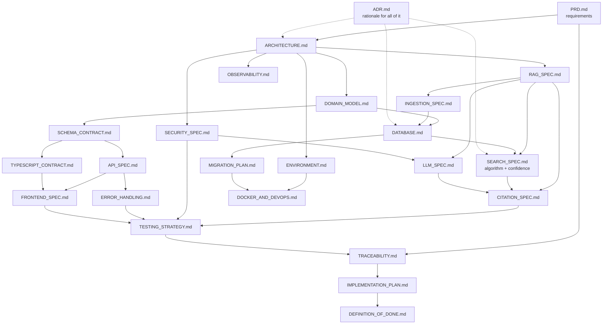

# AI Enterprise Document Intelligence System — Specification Package

**Project 3 · Tier 3 — Grounded Retrieval-Augmented Generation**
**Status:** Specification complete · pre-implementation · no application code has been written

---

## What this package is

A complete, interconnected engineering specification for a system that answers natural-language questions from an enterprise document corpus, where **every factual claim is traceable to an exact passage** and the system **deterministically refuses** when evidence is insufficient.

These 25 documents are the single source of truth for implementation. They are written so that a senior engineer who has never seen this project can begin building without reverse-engineering intent from code.

**The one sentence that explains every design choice in here:**

> Retrieved document evidence is authoritative; the LLM synthesises that evidence but must not invent unsupported facts — and the decision about whether enough evidence exists is made by deterministic backend arithmetic, before the model is ever called.

---

## The 25 documents

### Foundation — read in this order first

| # | Document | Authoritative for |
|---|----------|-------------------|
| 1 | **README.md** (this file) | Package structure, precedence, open decisions, consistency review |
| 2 | [PRD.md](PRD.md) | Problem, scope, `FR-*`, `NFR-*`, `BR-*`, edge cases, success criteria |
| 3 | [ARCHITECTURE.md](ARCHITECTURE.md) | Decomposition, boundaries, control flow, trust boundaries, sync vs async |

### Contracts — the "lock" that everything else depends on

| # | Document | Authoritative for |
|---|----------|-------------------|
| 4 | [DOMAIN_MODEL.md](DOMAIN_MODEL.md) | Entities, relationships, lifecycles, `INV-*`, enum values |
| 5 | [DATABASE.md](DATABASE.md) | Tables, types, constraints, indexes, pgvector, transaction boundaries |
| 6 | [API_SPEC.md](API_SPEC.md) | Routes, methods, status codes, wire examples |
| 7 | [SCHEMA_CONTRACT.md](SCHEMA_CONTRACT.md) | **Pydantic v2 models — the backend schema authority** |
| 8 | [TYPESCRIPT_CONTRACT.md](TYPESCRIPT_CONTRACT.md) | Type generation, drift prevention, error mapping |
| 9 | [FRONTEND_SPEC.md](FRONTEND_SPEC.md) | Routes, components, UI states, accessibility |

### The RAG core — where this project's difficulty lives

| # | Document | Authoritative for |
|---|----------|-------------------|
| 10 | [RAG_SPEC.md](RAG_SPEC.md) | Pipeline composition, context assembly, what the architecture refuses to do |
| 11 | [SEARCH_SPEC.md](SEARCH_SPEC.md) | **Retrieval algorithm, fusion, ranking, and the confidence formula** |
| 12 | [LLM_SPEC.md](LLM_SPEC.md) | Allowed/prohibited model responsibilities, prompts, structured output |
| 13 | [CITATION_SPEC.md](CITATION_SPEC.md) | Citation identity, validation, refusal text |
| 14 | [INGESTION_SPEC.md](INGESTION_SPEC.md) | Upload validation, extraction, chunking, state machine, failures |

### Cross-cutting

| # | Document | Authoritative for |
|---|----------|-------------------|
| 15 | [SECURITY_SPEC.md](SECURITY_SPEC.md) | Auth, upload security, prompt injection, secrets, logging limits |
| 16 | [ERROR_HANDLING.md](ERROR_HANDLING.md) | Error taxonomy, `ErrorCode` catalogue, handler order |
| 17 | [OBSERVABILITY.md](OBSERVABILITY.md) | Logging, metrics, audit events, alerts |
| 18 | [TESTING_STRATEGY.md](TESTING_STRATEGY.md) | Test layers, fixtures, the grounding acceptance suites |

### Delivery

| # | Document | Authoritative for |
|---|----------|-------------------|
| 19 | [DOCKER_AND_DEVOPS.md](DOCKER_AND_DEVOPS.md) | Containers, Compose, health checks, runbook |
| 20 | [MIGRATION_PLAN.md](MIGRATION_PLAN.md) | Alembic strategy, seeding, embedding-dimension changes |
| 21 | [ENVIRONMENT.md](ENVIRONMENT.md) | **Every environment variable — the defaults authority** |
| 22 | [ADR.md](ADR.md) | Decision rationale (15 ADRs) |
| 23 | [TRACEABILITY.md](TRACEABILITY.md) | Requirement → artefact → test matrix |
| 24 | [IMPLEMENTATION_PLAN.md](IMPLEMENTATION_PLAN.md) | 13 phases, ~100 tasks with prerequisites and acceptance criteria |
| 25 | [DEFINITION_OF_DONE.md](DEFINITION_OF_DONE.md) | Release acceptance checklist |

---

## Documentation dependency graph

An arrow means *"depends on / must not contradict"*.



---

## Source of Truth

When two documents disagree, resolve in this order. **The higher entry is correct and the lower one is a defect to be fixed** — not a matter of interpretation.

| Rank | Source |
|------|--------|
| 1 | The project architecture specification supplied by the user (`AI-Native Full-Stack & Agentic Systems Architecture.docx`, §4 Project 3) |
| 2 | [PRD.md](PRD.md) |
| 3 | [ARCHITECTURE.md](ARCHITECTURE.md) |
| 4 | Domain / database / API / schema contracts — [DOMAIN_MODEL.md](DOMAIN_MODEL.md), [DATABASE.md](DATABASE.md), [API_SPEC.md](API_SPEC.md), [SCHEMA_CONTRACT.md](SCHEMA_CONTRACT.md), [TYPESCRIPT_CONTRACT.md](TYPESCRIPT_CONTRACT.md) |
| 5 | Feature specifications — [RAG_SPEC.md](RAG_SPEC.md), [SEARCH_SPEC.md](SEARCH_SPEC.md), [LLM_SPEC.md](LLM_SPEC.md), [INGESTION_SPEC.md](INGESTION_SPEC.md), [CITATION_SPEC.md](CITATION_SPEC.md), [FRONTEND_SPEC.md](FRONTEND_SPEC.md), [SECURITY_SPEC.md](SECURITY_SPEC.md), [ERROR_HANDLING.md](ERROR_HANDLING.md), [OBSERVABILITY.md](OBSERVABILITY.md) |
| 6 | [IMPLEMENTATION_PLAN.md](IMPLEMENTATION_PLAN.md) |
| 7 | Source code |

**If the implementation disagrees with the specification, the implementation is wrong** unless the specification has been deliberately revised with an ADR.

### Narrow authorities that override rank

Some topics have one owner regardless of the ranking above, because a single definition site is the only way to prevent drift:

| Topic | Sole authority |
|-------|----------------|
| Pydantic model fields and validators | [SCHEMA_CONTRACT.md](SCHEMA_CONTRACT.md) — beats `API_SPEC.md` JSON examples |
| Retrieval algorithm, fusion, **confidence formula and threshold** | [SEARCH_SPEC.md](SEARCH_SPEC.md) — `RAG_SPEC.md` composes it but never redefines it |
| Environment variable names and default values | [ENVIRONMENT.md](ENVIRONMENT.md) — every other quotation is a copy |
| Enum string values | [DOMAIN_MODEL.md §5](DOMAIN_MODEL.md#5-enumerations-canonical-values) |
| Physical schema, constraints, indexes | [DATABASE.md](DATABASE.md) |
| `ErrorCode` values | [ERROR_HANDLING.md §3](ERROR_HANDLING.md#3-error-code-catalogue) |
| Citation validation rules | [CITATION_SPEC.md §5](CITATION_SPEC.md#5-validation-algorithm) |
| Ingestion failure codes and retryability | [INGESTION_SPEC.md §9](INGESTION_SPEC.md#9-failure-taxonomy) |

---

## How to use this package

### If you are implementing

1. Read `PRD.md` → `ARCHITECTURE.md` → `ADR.md`. Do not skip `ADR.md`; most "why is it done this way?" questions are answered there and nowhere else.
2. Read the four documents that define the product's actual difficulty: [SEARCH_SPEC.md §7–§8](SEARCH_SPEC.md#7-confidence-evaluation) (the confidence gate), [CITATION_SPEC.md §5](CITATION_SPEC.md#5-validation-algorithm) (citation validation), [LLM_SPEC.md §2–§3](LLM_SPEC.md#2-allowed-responsibilities) (what the model may and may not do), and [RAG_SPEC.md §11](RAG_SPEC.md#11-what-this-architecture-refuses-to-do) (what this architecture deliberately refuses to do).
3. Work through [IMPLEMENTATION_PLAN.md](IMPLEMENTATION_PLAN.md) top to bottom. Prerequisites are hard.
4. Every task names the spec section that defines its behaviour. **Read that section before writing the code, not after.**
5. If a spec is wrong, fix the spec first and record why. Never let the code and the spec disagree silently.

### If you are Claude Code or another agent

- Treat these documents as binding requirements, not suggestions.
- Never invent a field name, enum value, threshold, endpoint, or error code. If it is not in the specs, it does not exist yet — say so and ask.
- There are **no open decisions**. Every value the specs give — 1536 dimensions, `gpt-4o-mini`, S3 storage, 90/365-day retention — is settled by an ADR. If you believe one is wrong, say so and cite the ADR's reopen trigger; do not change it silently.
- Before writing any retrieval, confidence, or citation code, re-read the owning document. These are the parts most likely to be "improved" into incorrectness by pattern-matching against ordinary RAG tutorials — most of which do the opposite of what this spec requires.

### If you are reviewing

Use [DEFINITION_OF_DONE.md](DEFINITION_OF_DONE.md) §6. Those sixteen items are the product; the rest is machinery.

---

## Traceability overview

| Class | Count | Definition site | Fully mapped |
|-------|-------|-----------------|--------------|
| Functional requirements `FR-*` | 39 | [PRD.md §9](PRD.md#9-functional-requirements) | yes |
| Non-functional `NFR-*` | 14 | [PRD.md §10](PRD.md#10-non-functional-requirements) | yes |
| Business rules `BR-*` | 17 | [PRD.md §11](PRD.md#11-business-rules) | yes |
| Invariants `INV-*` | 31 | [DOMAIN_MODEL.md](DOMAIN_MODEL.md) §4, §8 | yes |
| Edge cases `EC-*` | 20 | [PRD.md §12](PRD.md#12-edge-cases) | yes |
| **Total traced** | **121** | | **121 / 121** |
| API endpoints `API-*` | 17 | [API_SPEC.md §1.1](API_SPEC.md#11-endpoint-index) | yes |
| ADRs | 25 | [ADR.md](ADR.md) | — |
| Decisions `DEC-*` | 10 | this file, [§Decision Register](#decision-register) | **10 / 10 resolved** |
| Mermaid diagrams | 15 | across 9 documents | all parse-validated |

Full matrix: [TRACEABILITY.md](TRACEABILITY.md). Every requirement names an implementing component **and** a verifying test. Note that this is *specified* coverage — no code exists yet; `T-12.1` re-runs the audit against the built system.

### The four invariants that are the product

| ID | Statement | Enforced in code | Enforced in the database |
|----|-----------|------------------|--------------------------|
| `INV-001` | Every citation was in that answer's assembled context | `CitationValidator` (`CIT-004`) | `answer_citations.chunk_id` FK |
| `INV-002` | An answered response carries ≥ 1 citation | `CitationValidator`, `SC-017` | `ck_answers_answered_shape` |
| `INV-003` | A refusal carries no citations, no prose, no model | fixed refusal templates | `ck_answers_refusal_shape` |
| `INV-004` | `confidence < threshold` ⟹ refusal | the gate (`RAG-017`) | `ck_answers_confidence_gate` |

Each is enforced twice, in independent layers, deliberately.

---

## Decision Register

**All ten decisions opened during drafting are resolved.** Each is recorded as an ADR with context, alternatives, rationale and consequences, and each carries an explicit **reopen trigger** so that "resolved" does not quietly become "never revisited".

| ID | Decision | Resolved by | Reopen when |
|----|----------|-------------|-------------|
| `DEC-001` | Embedding model and dimension → **`text-embedding-3-small` / 1536** | [ADR-016](ADR.md#adr-016) | `TEST-212` / `TEST-350` recall data justifies a larger model |
| `DEC-002` | OCR → **out of scope; detect and fail explicitly** | [ADR-017](ADR.md#adr-017) | Real demand for scanned corpora |
| `DEC-003` | Original-file storage → **S3-compatible; MinIO locally** | [ADR-018](ADR.md#adr-018) | — this *is* the scale-out choice |
| `DEC-006` | LLM model → **`gpt-4o-mini`, no tiering** | [ADR-019](ADR.md#adr-019) | `TEST-353` conflict accuracy is unacceptable |
| `DEC-007` | Retention → **purge originals at 90 days, keep chunks forever** | [ADR-020](ADR.md#adr-020) | Legal hold, or storage still growing |
| `DEC-008` | Rate-limit backend → **in-process behind a Protocol** | [ADR-021](ADR.md#adr-021) | **A second API replica** — the Redis adapter is its precondition |
| `DEC-009` | Question retention → **redact text at 365 days, keep the record** | [ADR-022](ADR.md#adr-022) | Legal or regulatory change |
| `DEC-010` | Multi-language → **English-only FTS** | [ADR-023](ADR.md#adr-023) | Corpus more than ~10% non-English |
| `DEC-011` | Chunk-size calibration → **sweep in Phase 5, before launch** | [ADR-024](ADR.md#adr-024) | The sweep contradicts the 512/64 defaults |
| `DEC-012` | Tracing → **correlated logs; OpenTelemetry pre-wired** | [ADR-025](ADR.md#adr-025) | A second deployable service exists |

*(`DEC-004` and `DEC-005` were folded into `DEC-001` and `DB-012`/`DB-024` during drafting; the identifiers are retired and not reused.)*

**No phase is blocked on a decision.** `DEC-001`, `DEC-003` and `DEC-006` previously gated Phases 2, 3 and 6; their values are now ordinary prerequisites. The only remaining Phase 0 gate is `T-0.5`, the labelled question sets.

### What resolving these actually changed

Three of the ten were not label-flips — they carried real design consequences that are now propagated through the package:

| Decision | Consequence |
|----------|-------------|
| `ADR-018` S3 storage | `storage` + `storage-init` Compose services; `STORAGE_S3_*` variables; `local` becomes a test-only adapter that production rejects (`ENV-034`, `ENV-036`); the API no longer shares a filesystem with the worker, which is what makes `ADR-010`'s worker split a Compose change rather than a redesign |
| `ADR-020` retention | New column `documents.original_purged_at`; retention sweep `RET-001`–`RET-006`; new error code `409 ORIGINAL_FILE_PURGED`, deliberately distinct from the transient `503` so a client can tell *never* from *try later*; new `FR-039`, `BR-017`, `INV-034` |
| `ADR-022` question redaction | `answers.question` becomes nullable **now**, so `AnswerResponse.question` is `str \| None` from day one (`SC-025`, `SEC-059`). Introducing that nullability when the first redaction fires would be a breaking API change a year after launch. New `INV-035`, `UI-066` |

`ADR-021` carries a smaller but real one: rate limits are now per-process, so `DOP-007` (`--workers 1`) is load-bearing for rate limiting as well as for the worker, and horizontal scaling has a documented precondition rather than a surprise.

## Consistency Review

A full cross-document review was performed after drafting. Method: automated extraction of every `ID-nnn` reference across all 25 documents to find dangling identifiers; automated link and anchor checking; automated Mermaid parsing; automated arithmetic verification of every worked confidence example; and manual review of enum values, thresholds, endpoint IDs, and field names.

### Issues found and fixed

| # | Issue | Where | Resolution |
|---|-------|-------|------------|
| 1 | **Confidence formula was internally inconsistent.** The similarity floor `τ_sim` was applied *before* the confidence window, which made the `coverage` term degenerate — `n_qual` would always equal `\|R\|` — and made four of the six worked examples arithmetically impossible | `SEARCH_SPEC` §6–§7 | Split the ranked output into `R_conf` (confidence window, unfiltered) and `R_context` (what the LLM sees, filtered). Added `SR-023`, `SR-024`, `SR-025`. All six worked rows re-derived and machine-verified |
| 2 | **Worked confidence values were wrong.** `0.7460` and `0.7841` did not follow from the stated weights | `SEARCH_SPEC` §7, `API_SPEC` `API-011` | Recomputed to `0.8480` and `0.8488`; every row in the table verified with a `Decimal` script matching the spec's own rounding rules |
| 3 | **Two Mermaid diagrams did not parse.** Semicolons inside `sequenceDiagram` message text | `ARCHITECTURE` §7, §9 | Rewritten. All 15 diagrams now validate against the Mermaid 11 parser |
| 4 | **Nine `UI-*` cross-references pointed at the wrong requirements** — other documents were written against a provisional numbering that `FRONTEND_SPEC` later superseded | `API_SPEC`, `SCHEMA_CONTRACT`, `SEARCH_SPEC`, `INGESTION_SPEC`, `CITATION_SPEC` | All repointed. Two genuinely missing requirements (`UI-048` entailment disclosure, `UI-049` locator precedence) were added rather than silently dropped |
| 5 | **Refusal example used the wrong `refusal_code`.** The `API-011` example showed `LOW_CONFIDENCE` with `top_similarity: 0.1932`, but every candidate below `τ_sim` yields `NO_CANDIDATES` | `API_SPEC` `API-011` | Corrected, and the message aligned to the matching `CIT-013` template |
| 6 | **`INV-009` and `INV-010` were referenced but never defined** | `PRD`, `LLM_SPEC` | Added [DOMAIN_MODEL.md §8](DOMAIN_MODEL.md#8-system-level-invariants) defining system-level invariants, including two new ones (`INV-013`, `INV-015`) that had been implied but unstated |
| 7 | **`BR-016` cited `LLM-009`, which does not exist** | `PRD` §11 | Repointed to `LLM-005`/`LLM-036`, and its test corrected from `TEST-905` to `TEST-353` |
| 8 | **`SEC-008` and `SEC-011` were referenced without their letter suffixes**, so the layered-defence and rate-limit controls had no resolvable target | `ARCHITECTURE`, `LLM_SPEC`, `SECURITY_SPEC` | Repointed to `SEC-008a`–`SEC-008g` and `SEC-011a`–`SEC-011f` |
| 9 | **`CIT-004` and `CIT-005` were defined only inside a code comment** despite being referenced from six documents | `CITATION_SPEC` §5 | Promoted to a normative table alongside `CIT-006` |
| 10 | **`pg_trgm` was required by `DB-012` but absent from the extensions list** | `DATABASE` §2 | Added |
| 11 | **Seven broken document anchors** (`#6-state-machine`, `#8-failure-taxonomy`, `#7-changing-the-embedding-dimension`, and four others) | 6 documents | All fixed; 0 broken links remain across 25 files |
| 12 | **`PRD` user journeys used illustrative numbers that contradicted the canonical example** (`0.71`, `0.14`) | `PRD` §6 | Aligned to `0.8488` and `0.1450` |

### Checks that passed with no findings

| Dimension | Result |
|-----------|--------|
| Enum values | Every value in `DOMAIN_MODEL` §5 appears identically in `SCHEMA_CONTRACT`, `TYPESCRIPT_CONTRACT`, `DATABASE` check constraints, and all prose. No case or spelling variants |
| Threshold consistency | `τ_conf = 0.45` and `τ_sim = 0.30` agree across all 9 documents that quote them; all defer to `ENVIRONMENT.md` |
| Top-K consistency | `RETRIEVAL_TOP_K = 8` consistent; the `API-010` cap of 50 vs `API-011` cap of 20 is deliberate and explained (`SR-014`) |
| Endpoint identity | All 17 `API-*` IDs, methods and paths agree between `API_SPEC`, `SCHEMA_CONTRACT` §11, `TRACEABILITY`, and `TYPESCRIPT_CONTRACT` §9 |
| Field names | `AnswerResponse`, `DocumentResponse`, `CitationResponse`, `SearchResultItem` and `IngestionStatusResponse` fields match exactly across `API_SPEC` examples, `SCHEMA_CONTRACT` models, and `TYPESCRIPT_CONTRACT` interfaces |
| Authentication model | Single consistent model — JWT, `admin`/`member`, no refresh tokens — across `SECURITY_SPEC`, `API_SPEC`, `PRD` `BR-010`–`BR-013`, and `ADR-015` |
| Citation format | `[n]` ASCII markers, contiguous from 1, defined once in `CIT-004a` and consistent in `LLM_SPEC`, `FRONTEND_SPEC`, `API_SPEC`, and `TESTING_STRATEGY` |
| Test coverage | Every `FR`, `NFR`, `BR`, `INV`, and `EC` maps to ≥ 1 `TEST-*` id; no orphans in either direction |
| Duplicated rules | Every rule stated in more than one place names its authority (Documentation Quality Rule 12). Spot-audited on: the confidence gate, citation validation, soft-delete semantics, and upload validation |

### Known and accepted tensions

Not defects — recorded so a reader does not mistake them for oversights.

| # | Tension | Why it stands |
|---|---------|---------------|
| 1 | **"A refusal never calls the LLM" is not literally true for `NO_VALID_CITATIONS`** | That refusal happens *after* generation. `RAG-050` resolves it explicitly: token usage moves to `confidence_report.attempted_llm` so `INV-003` and `ck_answers_refusal_shape` stay intact. The invariant users depend on is *"a refusal asserts nothing"*, not *"a refusal never spent a token"* |
| 2 | **`ADR-015` grants every authenticated user read access to every document** | Stated as assumption `A-7` and rule `BR-011`, with its reversal cost scoped. It is a real security property, not an oversight |
| 3 | **`CIT-012`: citations are not checked for semantic entailment** | Checking that a claim *follows from* its source would need a second probabilistic judge. The system guarantees the passage exists and is quoted accurately, and shows it verbatim so the reader can check the inference (`UI-048`) |
| 4 | **`SEC-033`: injection defence bounds behaviour, not summary content** | A document that genuinely contains hostile text can still be summarised misleadingly. Stated honestly rather than overclaimed |
| 5 | **`ING-026`: a crash mid-embedding discards all work for that document** | Buys the guarantee that no half-indexed state is ever reachable (`INV-006`). Correct for a system whose value is trustworthiness; costly on retry |
| 6 | **`ADR-014`: no streaming** | Streaming would display citations before validation. Revisitable only with a design that validates before display |

### Second pass — after resolving the decisions

Resolving `DEC-001`…`DEC-012` changed schema, configuration, wire contracts and the error catalogue, so the review was re-run. Consequences propagated rather than left dangling:

| Change | Propagated to |
|--------|---------------|
| `documents.original_purged_at` + `ck_documents_purge_requires_delete` | `DATABASE` §3.2, `DOMAIN_MODEL` §4.2 + ER diagram, `MIGRATION_PLAN` `0002`, `SCHEMA_CONTRACT` (`original_purged`), `TYPESCRIPT_CONTRACT`, `API_SPEC` examples, `FRONTEND_SPEC` `UI-067` |
| `answers.question` nullable + `question_redacted_at` | `DATABASE` §3.5, `DOMAIN_MODEL` §4.5 + ER diagram + mutability table + `INV-012`, `MIGRATION_PLAN` `0005`, `SCHEMA_CONTRACT` `SC-025`, `TYPESCRIPT_CONTRACT`, `API_SPEC` `API-012`/`API-013`, `FRONTEND_SPEC` `UI-066` |
| New error code `ORIGINAL_FILE_PURGED` | `ERROR_HANDLING` §3.1 + retry table, `API_SPEC` `API-009`, `TYPESCRIPT_CONTRACT` `ErrorCode` union |
| Retention sweep `RET-001`–`RET-006` | `DATABASE` §8.1 + `DB-040`, `OBSERVABILITY` §4/§5/§6/§10, `ENVIRONMENT` §8.1, `IMPLEMENTATION_PLAN` `T-3.15`, `DOCKER_AND_DEVOPS` `DOP-030` + runbook |
| MinIO / S3 topology | `DOCKER_AND_DEVOPS` §1/§4/§5/§9, `ENVIRONMENT` §8 + `ENV-034`/`ENV-036`, `INGESTION_SPEC` §3, `ARCHITECTURE` diagram, `IMPLEMENTATION_PLAN` `T-3.1`/`T-11.3` |
| New `FR-039`, `BR-017`, `INV-034`, `INV-035` | `PRD` §9/§11, `DOMAIN_MODEL` §8, `TRACEABILITY` §1/§3/§4/§7, `DEFINITION_OF_DONE` §4 |
| New tests `TEST-117`, `TEST-118`, `TEST-212`, `TEST-408`, `TEST-409`, `TEST-610` | `TESTING_STRATEGY` §3/§4/§6/§10, `TRACEABILITY` §8 |
| Chunk sweep ordering (`RAG-051`) | `RAG_SPEC` §2.1, `IMPLEMENTATION_PLAN` `T-5.11` prerequisites, `DEFINITION_OF_DONE` §6.16 |

One genuine ordering constraint surfaced only during this pass and is now recorded: **the chunk-size sweep must run before threshold calibration** (`RAG-051`). Chunk size changes the similarity distribution that `τ_conf` is tuned against, so calibrating the threshold first would mean calibrating it twice — and the second calibration would silently invalidate the first one's recorded justification.

One placement error was caught and fixed: the retention log events were initially appended to `OBSERVABILITY` §4.3 (retrieval and answering), where they did not belong. They now have their own §4.4, with `OBS-026` stating explicitly that a sweep which redacts sensitive text must not write that text to the log stream on its way out.

### Consistency review verdict

**No unresolved contradictions and no open decisions.** Twelve issues were found in the first pass and all twelve fixed; the resolution pass propagated every consequence listed above. Six tensions remain documented as deliberate. Automated checks — 0 broken links across 25 files, 15/15 Mermaid diagrams parsing against the Mermaid 11 parser, 121/121 requirements traced, all worked arithmetic verified with a `Decimal` script — pass.

The review is re-run as `T-12.2` against the implemented system, where "consistency" additionally means *the code matches all of this*.

---

## Implementation order

Full detail in [IMPLEMENTATION_PLAN.md](IMPLEMENTATION_PLAN.md).

```
Phase 0   Specification & contract lock       <- decisions DONE; remaining gate is T-0.5, the labelled question sets
Phase 1   Project scaffolding
Phase 2   Database & migrations
Phase 3   Document ingestion                  + T-3.15 retention sweep
Phase 4   Embedding & indexing
Phase 5   Hybrid retrieval                    + T-5.11 chunk-size calibration sweep
Phase 6   Grounded Q&A
Phase 7   Citation validation                 <- the real milestone; T-7.9 threshold calibration MUST follow T-5.11
Phase 8   Frontend                            (may start at Phase 5)
Phase 9   Security hardening                  (runs from Phase 3)
Phase 10  Automated testing                   (runs from Phase 3)
Phase 11  Docker & DevOps                     (runs from Phase 1)
Phase 12  Final review
```

**Phase 0 task `T-0.5` — building the labelled question sets — comes before implementation, not after.** Written afterwards, they get shaped to match whatever the system happens to do, which is the most common way a grounding evaluation quietly becomes worthless.

---

## What this system will not do

Recorded so absence is a decision, not an omission: OCR (`ADR-017`) · multi-tenancy · agent orchestration or MCP · streaming answers · conversation memory · formats beyond PDF and DOCX · per-document ACLs · cross-encoder reranking · a download endpoint for original files · answer caching.

Rationale for each: [PRD.md §3](PRD.md#3-non-goals-explicitly-out-of-scope-for-v1) and [ADR.md](ADR.md#superseded-and-rejected-ideas).

---

## Current status

| | |
|---|---|
| Specification | **Complete** — 25 documents, 121 traced requirements, 25 ADRs, 15 validated diagrams |
| Open decisions | **None.** All ten resolved (`ADR-016`…`ADR-025`), each with a reopen trigger |
| Blocked phases | **None** |
| Application code | **None.** No scaffolding, no placeholders, no stub endpoints — by instruction and by `Phase 0` |
| Next step | `T-0.5` — build the fixture corpus and the five labelled question sets. Then Phase 1 |
